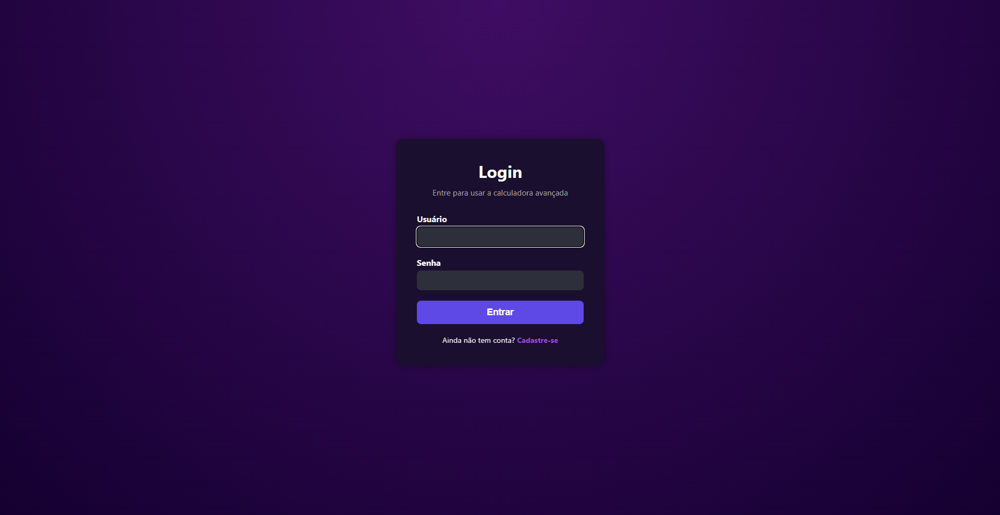

# Calculadora com Django

Portal web de uma calculadora interativa, com histórico de operações por usuário autenticado.

## Funcionalidades

- Cálculos básicos: Soma, Subtração, Multiplicação, Divisão
- Operações adicionais: Porcentagem e inversão de sinal
- Interface visual com botões numéricos
- Autenticação de usuários (login, logout e cadastro)
- Histórico de operações por usuário, armazenado em SQLite
- Botão para limpar histórico

## Interface

| Tela de Cadastro | Tela de Login | Calculadora | 
|  |  |  |

## Tecnologias usadas

- Python 3.13+
- Django 5.x
- HTML5, CSS3
- JavaScript (puro)
- SQLite (banco de dados local)

## Como rodar localmente

1. Clone o repositório
    - git clone https://github.com/LucasMAlc/Calculator.git

2. Crie e ative um ambiente virtual:
    - python -m venv venv
    - source venv/bin/activate  # Windows: venv\Scripts\activate
 
3. Instale as dependências 
    - pip install -r requirements.txt

4. Rode as migrações e o servidor
    - python manage.py migrate
    - python manage.py runserver

5. Acesse: http://127.0.0.1:8000
    * Use o /register/ para criar uma conta
    * Faça Login

